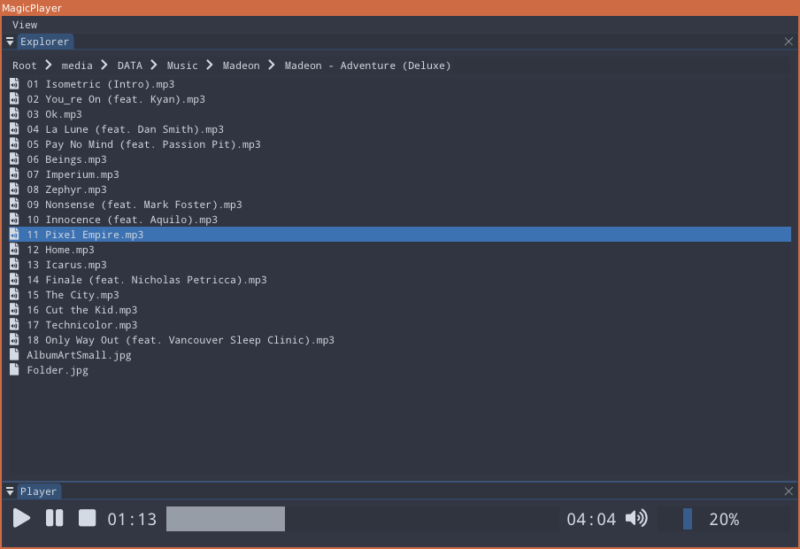

# MagicPlayer

MagicPlayer is a multi-platform lightweight music player. It is mostly developed for myself, but as it is free and open source, if you don't like powerful and full-featured music players, you can use it.

**Warning**: the project is still in an early stage, and a lot is still to be done.

Tested on Windows and Linux.

## Features

Supported audio formats are WAV (PCM only), OGG/Vorbis, FLAC and MP3 (MPEG 1.0/2.0/2.5 layer I/II/III). (more details [here](#supported-audio-formats)).

The GUI is separated in several views that can be resized and moved/docked. Currently implemented views are:
- *Player*: used to control playing music and volume
- *Explorer*: used to select audio files to play
- *Theme config*: used to select color theme or choose custom colors
- *Log viewer*: used to see internal logs (useful to debug)

## Dependencies

Libraries used:
- [Dear ImGui](https://github.com/ocornut/imgui): Bloat-free Immediate Mode Graphical User interface for C++ with minimal dependencies 
- [imgui-sfml](https://github.com/eliasdaler/imgui-sfml): ImGui binding for use with SFML
- [SFML](https://github.com/SFML/SFML): Simple and Fast Multimedia Library
- [libmpg123](https://sourceforge.net/projects/mpg123/): Fast and Free real time MPEG Audio Layer 1, 2 and 3 decoding library
- [spglog](https://github.com/gabime/spdlog): Fast C++ logging library
- [utfcpp](https://github.com/nemtrif/utfcpp): UTF-8 with C++ in a Portable Way

All libraries are built with MagicPlayer except libmpg123 which must be installed on Linux and is embedded on Windows.

Also, on Linux systems, if SFML is installed, by default the system version is used. To force SFML to be built with MagicPlayer, set CMake option ``COMPILE_SFML_WITH_PROJECT`` to ``ON``.

Fonts used:
- [DroidSans](https://www.droidfonts.com/): Font designed for Google Android platform
- [Font Awesome](https://fontawesome.com/): Icons font

Font Awesome is used with C++ headers generated by a script from [IconFontCppHeaders](https://github.com/juliettef/IconFontCppHeaders).

### Supported audio formats

MagicPlayer uses SFML and libmpg123 to decode audio files, so it should support all audio formats stated in the documentation of these libraries.

Extract of [SFML documentation](https://www.sfml-dev.org/tutorials/2.5/audio-sounds.php):

    SFML supports the audio file formats WAV, OGG/Vorbis and FLAC. Due to licensing issues MP3 is not supported. 

Extract of [libmpg123 documentation](https://www.mpg123.de/features.shtml):

    Features include: decoding of MPEG 1.0/2.0/2.5 layer I/II/III audio streams to interleaved PCM, also free-format bitrates over 320 kbit/s

## Build

Don't forget to pull the submodules with the repository using ``--recursive``:

    git clone --recursive https://github.com/pinam45/MagicPlayer.git

or if you have already cloned the repository:

    git submodule init
    git submodule update

To build the project you will need a C++17 compliant compiler. The project uses CMake to build, see [Running CMake](https://cmake.org/runningcmake/) for more information.

On linux, a common CMake use is:

	$ mkdir cmake-build
	$ cd cmake-build
	$ cmake ..
	$ make

On Windows, there is batch files available to configure a Visual Studio project in the ``ide`` folder.

## Run

At the moment MagicPlayer must be run in the folder containing the resources folder, otherwise fonts can't be loaded.

## Copyright

This work is under the MIT License

[Read the license file](LICENSE)
